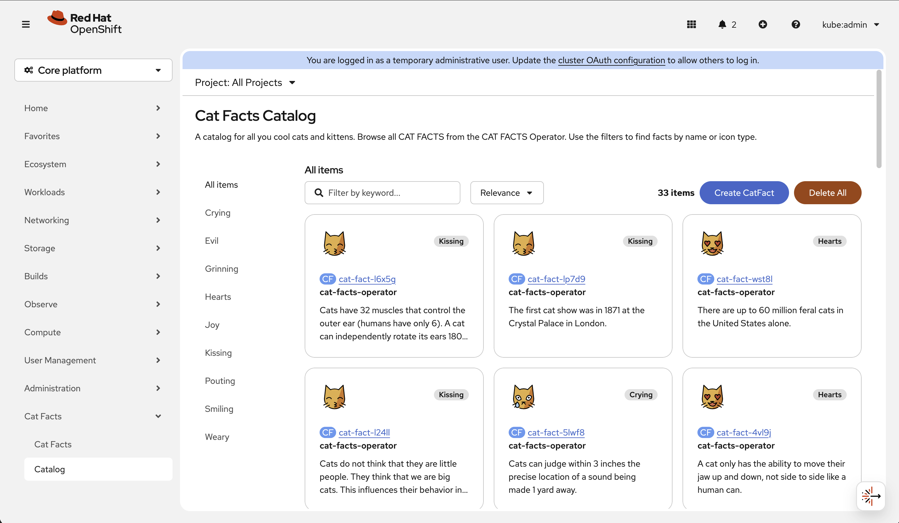
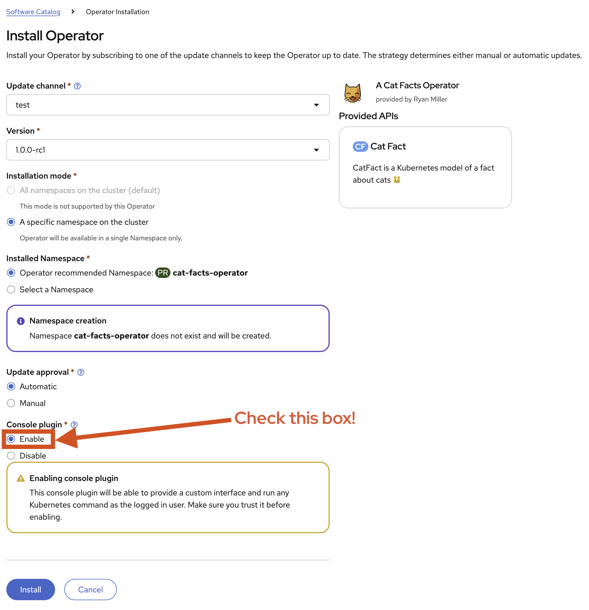

<!-- HTML hack to center content in a GitHub README -->
<p align="center">
    
</p>
<h1 align="center">
    Cat Facts Operator
</h1>
<h4 align="center">
    *Combining Hybrid-Cloud Technology With Cats*
</h4>
<p align="center">
    
</p>

## Cat Facts? 🙀

* ***Do you like to have fun?***
* ***Do you like OpenShift?***

If you answered either question, **install this operator!** (You don't even
have to like cats...)

## Seriously, what is it? 🤔

Red Hat allows applications to extend OpenShift's web UI with [OpenShift
Console Dynamic Plugins]. Red Hat provides docs for building plugins and
[deploying through Helm]. They don't provide a good operator-based deployment
reference.

Cat Facts Operator is the **community reference for operator-based OpenShift
console dynamic plugin deployment,** combining hybrid-cloud technology with
cats.

The operator is Go-based and built with [Operator SDK]. The operator also bundles
a React+PatternFly 6-based [OpenShift Console Dynamic Plugin] that serves
custom content in the OpenShift web console to manage operator resources.

Cat Facts Operator provides a Custom Resource Definition (CRD) for *CatFact*. A
CatFact is a Kubernetes resource that contains metadata along with a fact about
cats. Facts are queried from https://catfact.ninja/fact, a free API that
generates cat facts.

## Requirements 📋

* OKD/OpenShift 4.19 or later (Kubernetes 1.32.0+)

**NOTE:** OCP 4.19+ is required because the OpenShift dynamic console plugin
uses PatternFly 6, which was introduced starting with OpenShift 4.19.

## Installing 🚀

### OperatorHub

**I'm working on getting Cat Facts listed in OperatorHub. In the meantime,
install it by adding the custom CatalogSource below.**

### Custom Catalog (Testing)

Apply this object. After ~1 minute, search for "Cat Facts" under *Ecosystem >
Software Catalog* (previously labeled OperatorHub).

```yaml
apiVersion: operators.coreos.com/v1alpha1
kind: CatalogSource
metadata:
  name: cat-facts-catalog
  namespace: openshift-marketplace
spec:
  sourceType: grpc
  image: quay.io/ryanmillerc/cat-facts-catalog:latest
  displayName: Cat Facts
  publisher: Ryan Miller
  updateStrategy:
    registryPoll:
      interval: 10m
```

Follow the prompts to install operator page. Accept the default options for
everything **except for Console Plugin**. For security, OpenShift defaults
*Console Plugin* to *Disabled* on operators that come from community
catalogs. **Select *Enable* for *Console plugin* and install the operator.



It will take a few moments for the operator controller and dynamic console
plugin containers to download and launch. Within a few moments, you'll be able
to refresh and enjoy Cat Facts Operator.

## How to Use Cat Facts 😻

1. Navigate to *Cat Facts > Cat Fact Catalog* on the left-side navigation pane
   of the OpenShift console
2. Select *Create CatFact*
3. Select the new CatFact card to view it
4. Select *Create CatFact* again
5. Select *Create CatFact* 20 more times!!!
6. If you get bored and want to delete all your CatFacts, select
   *Delete All*

## Uninstalling 😿 

To uninstall, go to *Ecosystem > Installed Operators* in the OpenShift console.
Select "Cat Facts Operator" and uninstall.

After uninstalling, run these commands to clean up resources the operator
leaves behind:

```bash
oc delete catfacts --all -A
oc delete crd catfacts.ryanmillerc.github.io
oc delete csv --all -n cat-facts-operator
oc delete consoleplugin cat-facts-operator-console-plugin
oc delete namespace cat-facts-operator

# If using Test Cat Facts OLM CatalogSource
oc delete -n openshift-marketplace catalogsource cat-facts-catalog
```

## Acknowledgments

Cat facts are generated by the public [Cat Facts][cat-facts-api] API. 

Cat icons/emojis used in this project were created by Emily Jäger, licensed under
[CC BY-SA 4.0], and are [available here][cat-icons].

[CC BY-SA 4.0]: https://creativecommons.org/licenses/by-sa/4.0
[OpenShift Console Dynamic Plugins]: https://docs.redhat.com/en/documentation/openshift_container_platform/latest/html/web_console/dynamic-plugins
[Operator SDK]: https://sdk.operatorframework.io/
[cat-facts-api]: https://catfact.ninja
[cat-icons]: https://openmoji.org/library/#group=smileys-emotion%2Fcat-face
[deploying through Helm]: https://docs.redhat.com/en/documentation/openshift_container_platform/4.21/html/web_console/dynamic-plugins#deploy-on-cluster_deploy-plugin-cluster
