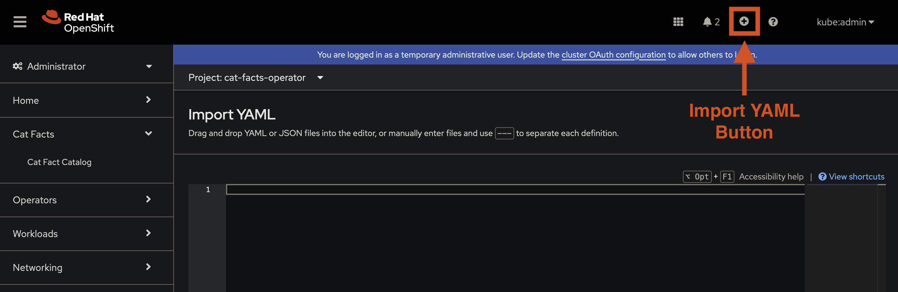
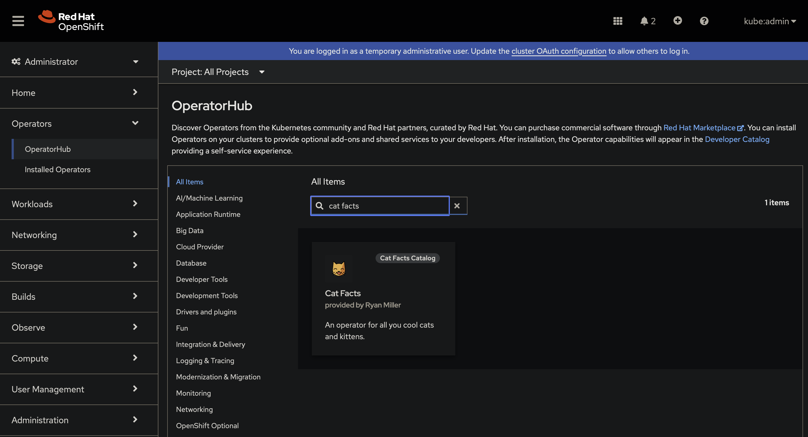
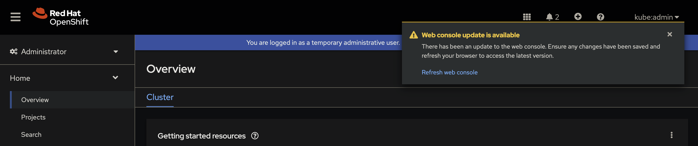

<!-- HTML hack to center content in a GitHub README -->
<p align="center">
    
</p>
<h1 align="center">
    Cat Facts Operator
</h1>
<h4 align="center">
    A Kubernetes operator for all you cool cats and kittens.
</h4>
<p align="center">
    
</p>

## Cat Facts?

* Do you like to have fun? 🙋‍♂️
* Do you like OpenShift? 🙋‍♂️

If you answered either question, **install this operator!** (You don't even have to like cats... 🙀)

## Seriously, what is it?

Cat Facts Operator is a Go-based Operator built with Operator SDK. This
operator bundles a React+PatternFly 6-based Dynamic Console Plugin that serves
custom content in the OpenShift web console to manage operator resources.

Cat Facts Operator provides a Custom Resource Definition (CRD) for *CatFact*. A
CatFact is a Kubernetes resource that contains metadata along with a fact about
cats. This operator uses https://catfact.ninja/fact to generate facts about
cats.

## Requirements

* OKD/OpenShift 4.19 or later (Kubernetes 1.32.0+)

**NOTE:** OCP 4.19+ is required because the OpenShift dynamic console plugin
uses PatternFly 6, which was introduced starting with OpenShift 4.19.

## Installing

**I'm working on getting Cat Facts listed in OperatorHub. In the meantime,
install it by adding a CatalogSource to your cluster.**

Use the *Import YAML* feature of the OpenShift console or `oc` command line
interface to create the CatalogSource object below.



```yaml
# Apply this object to your cluster to add the catalog to OperatorHub.
# Apply this object. After ~1 minute, search for "Cat Facts" under
# Ecosystem > Software Catalog (OperatorHub).
apiVersion: operators.coreos.com/v1alpha1
kind: CatalogSource
metadata:
  name: cat-facts-catalog
  namespace: openshift-marketplace
spec:
  sourceType: grpc
  image: quay.io/ryanmillerc/cat-facts-catalog:latest
  displayName: Cat Facts
  publisher: Ryan Miller
  updateStrategy:
    registryPoll:
      interval: 10m
```

After ~1 minute, navigate to Ecosystem > Software Catalog (OperatorHub) and search for "A Cat Facts Operator".



Follow the prompts to install operator page. Accept the default options for
everything **except for Console Plugin**. For security, OpenShift defaults
*Console Plugin* to *Disabled* on operators that come from community
catalogs. **Select *Enable* for *Console plugin* and install the operator.


It will take a few moments for the operator controller and dynamic console
plugin to load. When it's ready, OpenShift should prompt you to refresh.



## How to Use Cat Facts

1. Navigate to *Cat Facts > Cat Fact Catalog* on the left-side navigation pane
   of the OpenShift console
2. Select *Create CatFact*
3. Select the new CatFact card to view it
4. Select *Create CatFact* again
5. Select *Create CatFact* 20 more times!!
6. If you get bored and want to delete all your CatFacts, select
   *Delete All CatFacts*
7. 🎉

## Uninstalling

To uninstall, go to *Ecosystem > Installed Operators* in the OpenShift console.
Select "A Cat Facts Operator" and uninstall.

After uninstalling, run these commands to clean up resources the operator
leaves behind:

```bash
oc delete catfacts --all -A
oc delete crd catfacts.ryanmillerc.github.io
oc delete csv --all -n cat-facts-operator
oc delete consoleplugin cat-facts-operator-console-plugin
oc delete namespace cat-facts-operator

# If using Test Cat Facts OLM CatalogSource
oc delete -n openshift-marketplace catalogsource cat-facts-catalog
```

## Development

This project follows the Kubernetes [Operator Pattern].

It uses a [Controller] which provides a reconcile function responsible for
synchronizing resources untile the desired state is reached on the cluster.

Additionally, this project includes a React JS-based OpenShift Console Dynamic
Plugin, under the *./console-plugin* directory. For details on developing the
console plugin, view [./console-plugin/README.md](console-plugin/README.md).

The remainder of this document is specifically for developing and validating
the Go-based operator.

## Acknowledgments

Cat facts are generated by the public [Cat Facts][cat-facts-api] API. 

Cat icons/emojis used in this project were created by Emily Jäger, licensed under
[CC BY-SA 4.0], and are [available here][cat-icons].

[CC BY-SA 4.0]: https://creativecommons.org/licenses/by-sa/4.0
[cat-facts-api]: https://catfact.ninja
[cat-icons]: https://openmoji.org/library/#group=smileys-emotion%2Fcat-face
