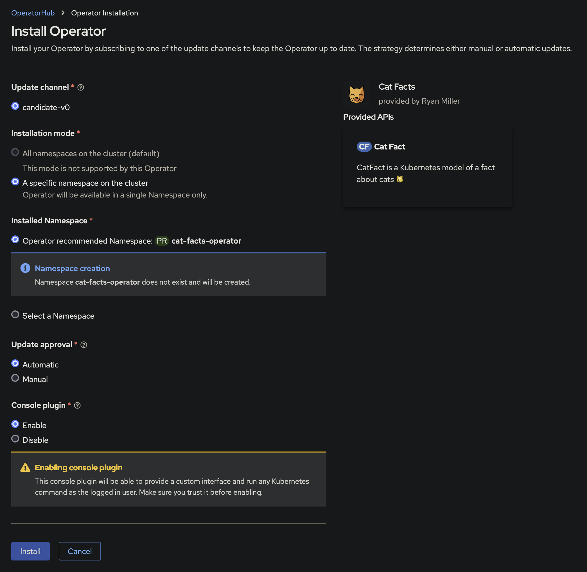

<!--
    This first chunk is HTML so it can be centered. I didn't have any luck
    wrapping all the elements in a <p> element with align="center". 🤷
-->
<p align="center">
    
</p>
<h1 align="center">
    Cat Facts Operator
</h1>
<h4 align="center">
    A Kubernetes operator for all you cool cats and kittens.
</h4>
<p align="center">
    
</p>

## Description

This is a proof-of-concept, just for fun, operator. This operator integrates a
custom UI into the OpenShift Console through a Dynamic Plugin.

Cat Facts Operator is a Go-based Operator built with the Operator SDK. I built
this as a proof-of-concept to learn operator development and distribution
through Operator Lifecycle Management (OLM). This operator includes an
OpenShift Dynamic Console Plugin that serves a front-end to manage operator
resources.

### What Does It Do?

Cat Facts Operator provides a Custom Resource Definition (CRD) for *CatFact*. A
CatFact is a Kubernetes resource that contains metadata along with a fact about
cats. It uses https://catfact.ninja/fact to generate facts about cats.

## Requirements

* OKD/OpenShift 4.11 or later

**NOTE:** Cat Facts Operator should work on older versions of OpenShift and
on other Kubernetes distributions; **however, the console dynamic plugin UI
(the main feature of this operator) will not be installed.** The controller and
CatFact CRD will install and should work as expected.

## Installing

Cat Facts Operator is distributed through an OLM catalog. Cat Facts Operator is
not included in any default OperatorHub catalog so you'll need to create a
CatalogSource to install it.

Use the *Import YAML* feature of the OpenShift console or `oc` command line
interface to create the CatalogSource object below.


```yaml
# Apply this object to your cluster to add the catalog to OperatorHub.
# After ~1 minute, search for "Cat Facts" in OperatorHub.
apiVersion: operators.coreos.com/v1alpha1
kind: CatalogSource
metadata:
  name: cat-facts-catalog
  namespace: openshift-marketplace
spec:
  sourceType: grpc
  image: quay.io/rymiller/cat-facts-catalog:latest
  displayName: Cat Facts Catalog
  publisher: Ryan Miller
  updateStrategy:
    registryPoll:
      interval: 10m
```

After ~1 minute, navigate to OperatorHub and search for "Cat Facts".


Follow the prompts to install operator page. Accept the default options for
everything **except for Console Plugin**. For security, OpenShift defaults
*Console Plugin* to *Disabled* on operators that come from non-official
catalogs. Select *Enable* for *Console plugin* and install the operator.



Within ~1 minute after the installation completes, you will be prompted to
refresh your OpenShift console in the top-right corner.


## How to Use Cat Facts

1. Navigate to *Cat Facts > Cat Fact Catalog* on the left-side navigation pane
   of the OpenShift console
2. Select *Create CatFact*
3. Select the new CatFact card to view it
4. Select *Create CatFact* again
5. Select *Create CatFact* 20 more times!!
6. If you get bored and want to delete all your CatFacts, select
   *Delete All CatFacts*
7. 🎉

## Uninstalling

To uninstall, go to *Operators > Installed Operators* in the OpenShfit console.
Select the Cat Facts Operator and uninstall.

After uninstalling, run these commands to clean up resources the operator
leaves behind:

```bash
# Remove all CatFacts
oc delete -n cat-facts-operator $(oc get -n cat-facts-operator catfacts -o name)

# Remove the CatFacts CRD
oc delete crd catfacts.taco.moe

# Remove the OpenShift console plugin
oc delete consoleplugin cat-facts-operator-console-plugin

# Remove the cat-facts-operator namespace
oc delete namespace cat-facts-operator

# Optional: Remove the Cat Facts OLM CatalogSource
oc delete -n openshift-marketplace catalogsource cat-facts-catalog
```

## Development

This project follows the Kubernetes [Operator Pattern].

It uses a [Controller] which provides a reconcile function responsible for
synchronizing resources untile the desired state is reached on the cluster.

Additionally, this project includes a React JS-based OpenShift Console Dynamic
Plugin, under the *./console* directory. For details on developing the console
plugin, view [./console/README.md](console/README.md).

The remainder of this document is specifically for developing and validating
the Go-based operator.

## Acknowledgments

Cat facts are generated by the public [Cat Facts][cat-facts-api] API. 

Cat icons/emojis used in this project were created by Emily Jäger, licensed under
[CC BY-SA 4.0], and are [available here][cat-icons].

[CC BY-SA 4.0]: https://creativecommons.org/licenses/by-sa/4.0
[cat-facts-api]: https://catfact.ninja
[cat-icons]: https://openmoji.org/library/#group=smileys-emotion%2Fcat-face
